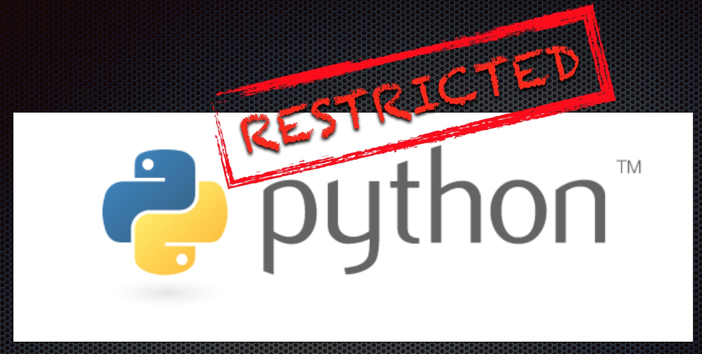

.. RestrictedPython documentation master file, created by
   sphinx-quickstart on Thu May 19 12:43:20 2016.
   You can adapt this file completely to your liking, but it should at least
   contain the root `toctree` directive.

============================================
Welcome to RestrictedPython's documentation!
============================================

RestrictedPython is a tool that helps to define a subset of the Python language which allows to provide a program input into a trusted environment.
RestrictedPython is not a sandbox system or a secured environment, but it helps to define a trusted environment and execute untrusted code inside of it.

Supported Python versions
=========================

RestrictedPython supports CPython 3.7 up to 3.12.
It does _not_ support PyPy or other alternative Python implementations.

Contents
========

.. toctree::
   :maxdepth: 2

   idea
   install/index
   usage/index
   usage/api

   roadmap/index
   contributing/index

   changes

Indices and tables
==================

* :ref:`genindex`
* :ref:`modindex`
* :ref:`search`
